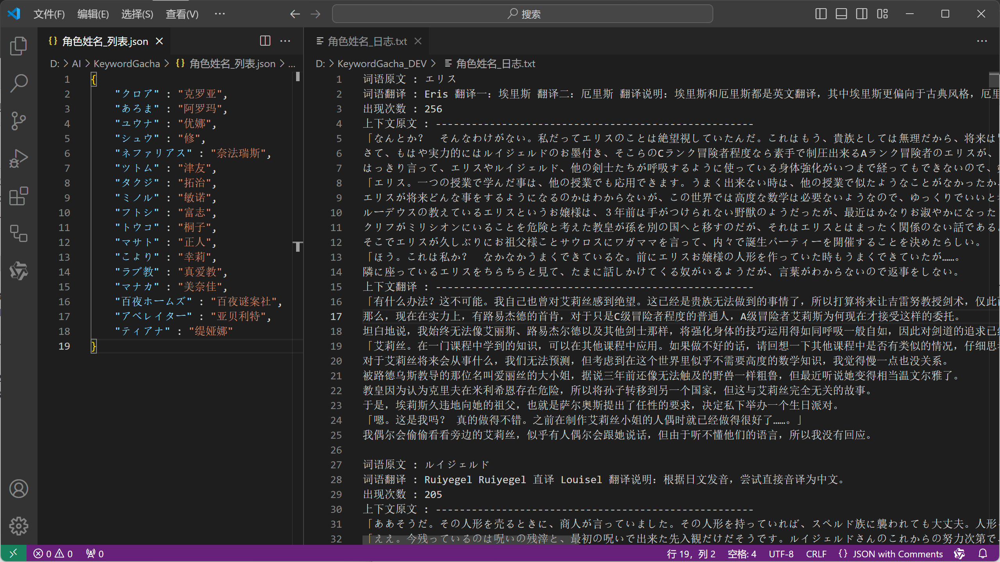

> [!TIP]
> # KeywordGacha
> #### 一个使用 OpenAI 兼容接口来抓取小说、游戏脚本等任意文本中的名词表的工具

### 概述 📢
- [KeywordGacha](https://github.com/neavo/KeywordGacha)，简称KG，是一个使用 AI 技术来抽取文本中名词表的次世代工具
- 可以一键从长篇文本中抽取角色名称、地域名称、组织名称等专有名词的名词表与参考文献并自动翻译
- 相较传统工具，KG 具有高命中、语义化、自动抓取相关文献等特色，并且对文本的格式、语言和内容没有要求
- 使用 KG 优化工作流，可以极大的提升 小说、漫画、字幕、游戏脚本 等文本内容的译前准备名词表的工作效率

> 

> 
  
### 要求 🖥️
- 兼容 OpenAI 接口格式的大语言模型 API，本地与在线接口均可
- KG 的开发环境是本地运行的 [Qwen2-7B-Instruct](https://huggingface.co/Qwen/Qwen2-7B-Instruct-GGUF)

### 使用 🛸
- 从 [发布页](https://github.com/neavo/KeywordGacha/releases) 下载 KG，并解压缩到本地
- 打开配置文件 `config.json` ，填入 API 信息，如使用本地接口则不需要修改
- 双击 `KeywordGacha.exe`，按提示操作即可
- 流程执行完毕后，会生成结果文件 `角色姓名_日志.txt` 与 `角色姓名_列表.json`
- `角色姓名_日志.txt` 中包含抓取到的名词的列表，以及用于参考翻译的相关片段和翻译参考
- 参考日志中的各项信息完成 `角色姓名_列表.json` 后，就可以直接导入到 [AiNiee](https://github.com/NEKOparapa/AiNiee) 等翻译器中使用了

### 效果 ⚡
- 抓取和翻译效果取决于模型本身的水平，使用 💪 ~~更昂贵~~ 更强力  的 模型可以显著提升效果
- 是的，氪金可以变强
- 但是即使只使用运行在本地电脑上的小规模开源模型，效果和效率也远超传统工具
- 如果你有一台拥有至少8G显存的Nvidia显卡的电脑，可以通过作者提供的 [一键包](https://github.com/neavo/KeywordGachaServer) 来使用本地模型
  
> [!CAUTION]
> ### 用于分词与用于翻译的服务器端配置不一样 ！！！
> ### 请严格按照一键包里的脚本与模型链接跑通一次再折腾 ！！！

### 文本格式 🆗
- 目前支持对两种文本格式的解析，抓取效果不好时，可以两种都试试
- 文件中 每一行/每一条 应只包含一个句子，太长的话请先手动处理一下
- 如当前目录下有 `all.orig.txt` 或 `ManualTransFile.json` 文件，会自动识别
- 当文件后缀名为 .json 时，会将其内容按以下模式处理，这也是 [MTool](https://afdian.net/a/AdventCirno) 导出翻译原文的格式

```json
  {
      "原文": "译文",
      "原文": "译文",
      "原文": "译文"
  }
```

- 当文件后缀名为 .txt 时，会将其内容按以下模式处理，即每行一句的纯文本内容，使用 [SExtractor](https://github.com/satan53x/SExtractor) 可以抓取这样的文本
  
```ini
      原文<换行符>
      原文<换行符>
      原文<换行符>
```

### 设置说明 🎚️

  ```json
    {
        "api_key": "sk-no-key-required", // 你所使用 API 接口的密钥，从接口平台方获取，默认为本地接口
        "base_url": "译文http://localhost:8080/v1", // 你所使用 API 接口的地址，从接口平台方获取，默认为本地接口
        "model_name": "qwen2-7b-instruct", // 你所使用 API 接口的模型名称，从接口平台方获取，默认为本地接口
  
        "translate_surface_mode": "1", // 词表的后处理模式，默认为 1 即日中翻译，设为 0 可以跳过翻译，抓取中文内容时使用
        "translate_context_mode": "1", // 上下文的后处理模式，默认为 1 即日中翻译，设为 0 可以跳过翻译，抓取中文内容时使用
    }
  ```

### 语言能力 🗣️

- 较新的模型比如 [GPT4o](https://chatgpt.com/)、[Claude 3.5 Sonnet](https://claude.ai/) 等具有超乎想象多语言能力，但是也十分昂贵
- [Qwen2](https://github.com/QwenLM/Qwen2) 在处理中文的表现上称得上优秀，处理日文水平也算是差强人意

### 开发计划 🎢

- [ ] 支持 [Translator++](https://dreamsavior.net/translator-plusplus/) 导出的 CSV 文本
- [ ] 添加 对英文文本的支持

### 友情提醒 💰
  - KG 会将 `全部的文本` 发送至 AI 进行处理，这个过程会消耗大量的 Token
  - 如使用在线接口，请关注你的账单！
