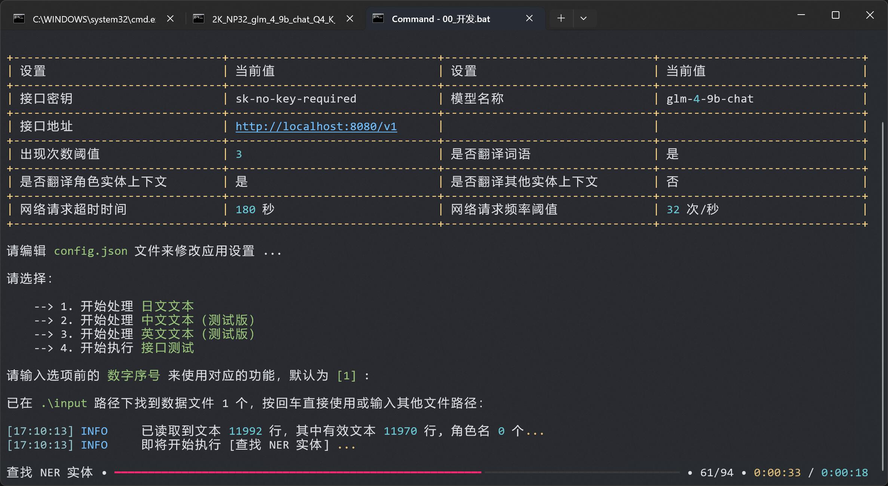
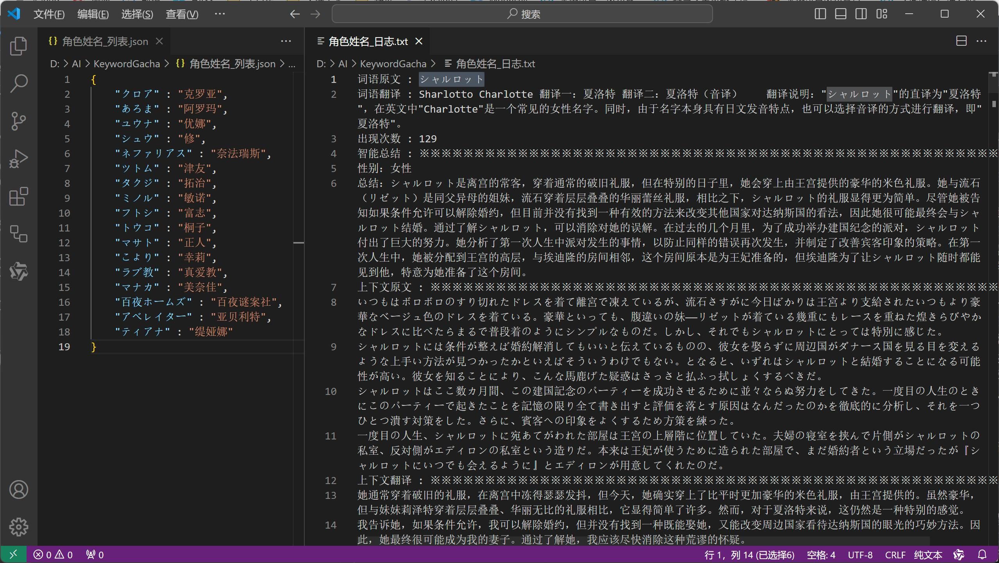

<h1><p align='center' >KeywordGacha</p></h1>
<div align=center>      </div>
<p align='center' >使用 OpenAI 兼容接口自动生成小说、漫画、字幕、游戏脚本等任意文本中的词语表的翻译辅助工具</p>

&ensp;
&ensp;


## 概述 📢
- [KeywordGacha](https://github.com/neavo/KeywordGacha)，简称 KG，使用 AI 技术来自动生成词语表的次世代工具
- 从长篇文本中 `一键抓取实体词语`，然后 `自动翻译`、`自动总结`、`自动生成词语表`
- 相较传统工具，具有高命中、语义化、智能总结角色信息等特色，对文本的兼容性更好
- 极大的提升 `小说`、`漫画`、`字幕`、`游戏脚本` 等内容译前准备时制作词语表的工作效率
- 随机选取 [绿站榜单作品](https://books.fishhawk.top) 作为测试样本，与人工校对制作的词表对比，命中率约为 `80%-90%`

> 

> 
  
## 要求 🖥️
- 兼容所有 OpenAI 标准的 AI 大模型接口
- 可以使用 ChatGPT 系列、Claude 系列 或 众多国产模型 接口
- 也可以运行 `本地模型` 来获得 `完全免费` 的服务（需要 8G 以上显存的 Nvidia 显卡）

## 使用流程 🛸
- 从 [发布页](https://github.com/neavo/KeywordGacha/releases) 下载应用，两个版本任选其一
  - `KeywordGacha_*.zip` 基础版本，适用于所有设备
  - `KeywordGacha_NV_*.zip` GPU 加速版本，可以极大幅度提升处理速度，暂时只支持 Nvidia 显卡
- 打开配置文件 `config.json`，填入 API 信息，默认为使用本地接口
- 双击 `01_启动.bat` 启动应用，处理流程结束后，结果会保存在 `output` 文件夹内
- 其中：
  - `*_日志.txt` - 抓取到的词语的原文、上下文、翻译建议、角色信息总结等详细信息，用于人工确认
  - `*_列表.json` - 通用词表，可以导入 [AiNiee - 替换词典](https://github.com/NEKOparapa/AiNiee)、[术语表工作区](https://books.fishhawk.top/workspace/katakana) 等处使用
  - `*_ainiee.json` - [AiNiee - 提示字典](https://github.com/NEKOparapa/AiNiee) 功能专用词语表
  - `*_galtransl.json` - [GalTransl - GPT字典](https://github.com/xd2333/GalTransl) 功能专用词语表

## 抓取效果 ⚡
- `抓取`、`总结` 和 `翻译` 效果取决于模型的能力，使用 💪 ~~更昂贵~~ 更强力  的模型可以显著提升效果
- 是的，氪金可以变强
- 各家的旗舰模型的如 [GPT4o](https://chatgpt.com)、[Claude 3.5 Sonnet](https://claude.ai) 效果十分好
- 总体来说在线接口的效果远好于本地模型，推荐使用在线模型，比如又快又便宜的 [DeepSeek](https://github.com/neavo/KeywordGacha/wiki/DeepSeek-%E6%8E%A5%E5%8F%A3%E8%AE%BE%E7%BD%AE%E6%95%99%E7%A8%8B)
- 不过本地模型效果也还不错，如果有 8G+ 显存的 Nvidia 显卡，可以使用 [一键包](https://github.com/neavo/KeywordGachaServer) 来搭建本地接口

## 文本格式 🏷️
- 支持从 `.txt`、`.csv`、`.json` 三种文件中读取文本
- 大部分主流的 `小说` 和 `游戏脚本` 数据格式都可以直接或者通过转换被 KG 识别
- 输入路径是文件夹时，会读取文件夹内所有的 `txt`、`csv` 和 `json` 文件
- 当应用目录下有 `input` 文件夹时，会自动读取文件夹内所有的 `txt`、`csv` 和 `json` 文件
- 具体可见 [Wiki - 支持的文件格式](https://github.com/neavo/KeywordGacha/wiki/%E6%94%AF%E6%8C%81%E7%9A%84%E6%96%87%E4%BB%B6%E6%A0%BC%E5%BC%8F)

## 近期更新 📅
- 20240810 v0.1.0
  - 修正 - 一个系统兼容性问题
  - 调整 - 优化了对游戏文本的支持和抓取能力
  - 新增 - 自动生成 AiNiee 与 GalTransl 格式的词典

- 20240808
  - 新增 - 接口测试 功能
  - 新增 - 非人名实体上下文翻译 功能，默认关闭
  - 调整 - NER 模型更新，抓取能力显著强化
    - 特别是对非角色实体的抓取能力
  - 调整 - 处理速度优化
    - 优化了 `语义分析` 的流程，用更少的步骤达到了更好的效果，速度 +100%
    - 在 Nvidia 显卡上可以启用 GPU 加速了，`NER 实体识别` 步骤，速度 +500%

- 20240724
  - 调整 - 现在三种格式都可以从文件夹中批量读取了
  - 修正 - 出现次数为 0 导致的除数问题

## 设置说明 🎚️

```json
{
    "api_key": [
        "sk-no-key-required",
        "接口密钥，从接口平台方获取，使用在线接口时一定要设置正确。"
    ],
    "base_url": [
        "http://localhost:8080/v1",
        "请求地址，从接口平台方获取，使用在线接口时一定要设置正确。"
    ],
    "model_name": [
        "glm-4-9b-chat",
        "模型名称，从接口平台方获取，使用在线接口时一定要设置正确。"
    ],
    "count_threshold": [
        3,
        "出现次数阈值，出现次数低于此值的词语会被过滤掉，调低它可以抓取更多低频词语。"
    ],
    "request_timeout": [
        180,
        "网络请求超时时间，如果频繁出现 timeout 字样的网络错误，可以调大这个值。"
    ],
    "request_frequency_threshold": [
        4,
        "网络请求频率阈值，单位为 次/秒，值可以小于 1，如果频繁出现 429 代码的网络错误，可以调小这个值，特别很多便宜的中转。",
        "使用 DeepSeeker 等不限制并发数的接口可以调大，可以极大的加快处理的速度。"
    ],
    "translate_surface": [
        1,
        "是否翻译词语，1 - 翻译，0 - 不翻译，启用词语翻译后会自动完成词表。"
    ],
    "translate_context_per": [
        1,
        "是否翻译人名实体上下文，1 - 翻译，0 - 不翻译，比较慢，根据需求自己决定是否开启。"
    ],
    "translate_context_other": [
        0,
        "是否翻译其他实体上下文，1 - 翻译，0 - 不翻译，比较慢，根据需求自己决定是否开启。"
    ]
}
```

## 傻瓜教程 📖
- [推荐 👏] 如果愿意出一点小钱（一本书几毛钱）来获得快速且高质量的抓取结果，请查看 [此教程](doc/deepseek.md)
- 如果拥有 8G+ 显存的 Nvidia 显卡，可以使用 [一键包](https://github.com/neavo/KeywordGachaServer) 搭建本地接口实现完全的白嫖

## 最佳实践 💰
- 处理 `小说` 时
  - 注意单行不要太长，目前模型能处理的单行最大长度约为500字，过长的句子会被截断 
- 处理 `游戏文本` 时
  - 建议使用 [SExtractor](https://github.com/satan53x/SExtractor) 、[Translator++](https://dreamsavior.net/translator-plusplus/) 导出文本
  - [MTool](https://afdian.net/a/AdventCirno) 导出文本的抓取效果很不稳定
  - 如果抓取效果不好，可以多试几种导出工具和导出格式，往往会有奇效

## 开发计划 📈
- [x] 支持 [Translator++](https://dreamsavior.net/translator-plusplus/) 导出的 CSV 文本
- [X] 添加 对 组织、道具、地域 等其他名词类型的支持
- [ ] 添加 对 `英文内容` 的支持
- [ ] 添加 对 `中文内容` 的支持
- [ ] 添加 对 `韩文内容` 的支持
- [X] 添加 对 GPU 加速的支持
- [X] 添加 全自动生成模式

## 问题反馈 😥
  - 运行时的日志保存在程序目录下的 `KeywordGacha.log` 等日志文件内
  - 反馈问题的时候请附上这些日志文件
